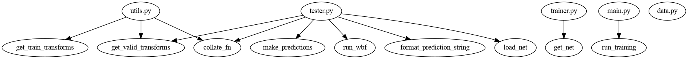

# Function Finder 
 -----

 - This is now on pypi!!! [Link](https://pypi.org/project/functionvis/)

 - Every found a library with so many files you lose track of which function/class comes from where?
 - What if you could see it visually :o
 
 I keep facing this problem everytime and I decided to act on it once and for all.

## Supports

- .py (Normal python file)
- .ipynb (If you have it for python that is)

## How to run

 - Do a pip install functionvis
 - Get requirements (Pathlib, graphviz, jupytext)
 - Install graphviz (If you have linux you can get it from apt/aur ; For windows install it from their site)
 - python
 - ```py
    import functionvis
    functionvis.mainrunner()
    ```
> This also takes Jupyter notebooks into account

 ## Outputs

(Find them in your project directory as classes.png and functions.png)

 - Functions

 
 - Modules
 
 
 ## ToDo + Contributions
 
 - Other languages such as Julia/C/Java etc.
 - Contributions welcome
 - Bugs will be squashed if you tell me what they are
